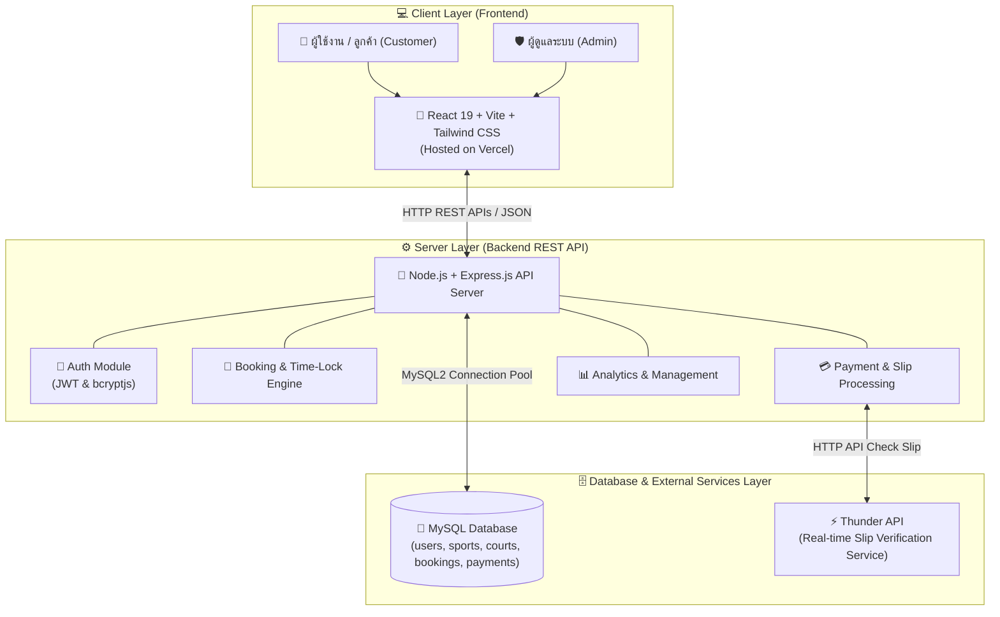

# 📌 สถาปัตยกรรมและเทคโนโลยีที่ใช้ (Architecture & Tech Stack)
## ระบบจองและจัดการสนามกีฬา (Sport Complex Booking System)

---

### 💻 1. เทคโนโลยีที่เลือกใช้ (Tech Stack)

#### **Frontend (ฝั่งผู้ใช้งาน - โฟลเดอร์ `frontend/`)**
* **Core Framework:** React 19 (`react` ^19.2.8) รันบน Vite (`vite` ^8.2.0) ช่วยให้โหลดหน้าเว็บได้รวดเร็วแบบ Single Page Application (SPA)
* **Styling:** Tailwind CSS v4 (`@tailwindcss/vite` ^4.3.3) สำหรับออกแบบ UI แบบ Responsive รองรับหน้าจอคอมพิวเตอร์และมือถือ
* **Routing:** React Router DOM v7 (`react-router-dom` ^7.18.2) จัดการเส้นทางในเว็บ (หน้าแรก, จองสนาม, ประวัติการจอง, แผงควบคุมแอดมิน)
* **HTTP Client:** Axios (`axios` ^1.19.0) สำหรับรับ-ส่งข้อมูลกับ Backend REST API
* **UI Components & Icons:** Lucide React (`lucide-react`) สำหรับไอคอน และ React Hot Toast (`react-hot-toast`) สำหรับการแจ้งเตือนแบบ Popup Notification

#### **Backend (ฝั่งประมวลผลเซิร์ฟเวอร์ - โฟลเดอร์ `backend/`)**
* **Runtime & Framework:** Node.js + Express.js v5 (`express` ^5.2.1) บริหารจัดการ RESTful APIs
* **Database Driver:** MySQL2 (`mysql2` ^3.22.3) รองรับ Connection Pooling และ Database Transactions เพื่อความถูกต้องของข้อมูล
* **Authentication & Security:** JSON Web Token (`jsonwebtoken` ^9.0.3) สำหรับยืนยันตัวตนผ่าน JWT และ `bcryptjs` (^3.0.3) สำหรับเข้ารหัสรหัสผ่าน (Password Hashing)
* **File Upload Handling:** Multer (`multer` ^2.1.1) สำหรับจัดการการอัปโหลดไฟล์รูปภาพสลิปการโอนเงิน
* **Third-Party Integration:** Axios (`axios`) ร่วมกับ `form-data` สำหรับการรับส่งข้อมูลไปตรวจสลิปกับ **Thunder API** แบบ Real-time
* **API Documentation & Logging:** Swagger UI Express (`swagger-ui-express`) สำหรับเอกสารทดสอบ API และ Winston (`winston`) สำหรับระบบบันทึก Log

#### **Database (ระบบฐานข้อมูล - อ้างอิงจาก `schema_utf8.sql`)**
* **Database Engine:** MySQL / MariaDB (ใช้ Character Set `utf8mb4_unicode_ci` รองรับภาษาไทยสมบูรณ์)
* **โครงสร้างตารางหลัก (5 Tables):**
  1. `users`: ข้อมูลสมาชิกและผู้ดูแลระบบ (ระบุ role เป็น `customer` หรือ `admin`)
  2. `sports`: รายการประเภทกีฬา (ฟุตบอล, บาสเกตบอล, แบดมินตัน, วอลเลย์บอล)
  3. `courts`: ข้อมูลสนาม รายละเอียด ราคาต่อชั่วโมง และสถานะ (`active`, `maintenance`)
  4. `bookings`: รายการจอง วันเวลา ยอดรวม เบอร์ติดต่อ และสถานะใบจอง (`pending_payment`, `approved`, `cancelled` ฯลฯ)
  5. `payments`: ประวัติการชำระเงิน รูปสลิป เวลาโอน transaction_ref หรือวิธีจ่ายเงินสด

#### **Deployment & Hosting (การติดตั้งและเผยแพร่)**
* **Frontend Hosting:** Vercel (`sport-complex-plan.vercel.app`)
* **Backend API Hosting:** Node.js Application Cloud Hosting
* **Database Hosting:** MySQL Cloud Database Server

---

### 🏗️ 2. ภาพรวมสถาปัตยกรรมระบบ (System Architecture Diagram)

---

### 🔄 3. คำอธิบายการทำงานของระบบ (Workflow Explanation)

1. **ผู้ใช้ส่งคำขอ (User Request):** ผู้ใช้ใช้งานผ่าน React 19 SPA บนเว็บเบราว์เซอร์ เลือกสนาม วันเวลา และส่งคำขอผ่าน HTTP REST API (Axios)
2. **การประมวลผลที่ Backend (Server Processing):** Express.js รับ Request ตรวจสอบสิทธิ์ด้วย JWT และประมวลผลคำขอ (เช่น ระบบจะเริ่มนับเวลาถอยหลัง 15 นาทีล็อกสนาม)
3. **การบันทึกฐานข้อมูล (Database Operation):** ทำการค้นหาและอัปเดตข้อมูลลง MySQL Database ผ่าน Transaction เพื่อป้องกันปัญหาข้อมูลขัดแย้ง
4. **การตรวจสอบสลิปอัตโนมัติ (Automated Slip Verification):** เมื่อผู้ใช้อัปโหลดสลิปโอนเงิน Express Backend จะส่งไฟล์สลิปและข้อมูลไปยัง Thunder API แบบ Real-time หากข้อมูลถูกต้อง Backend จะเปลี่ยนสถานะการจองเป็น `approved` ใน MySQL ทันที
5. **การแสดงผลตอบกลับ (Response):** ส่งผลลัพธ์ JSON กลับไปยัง Frontend เพื่ออัปเดต UI หน้าจอทันทีโดยไม่ต้อง Refresh หน้าเว็บ
