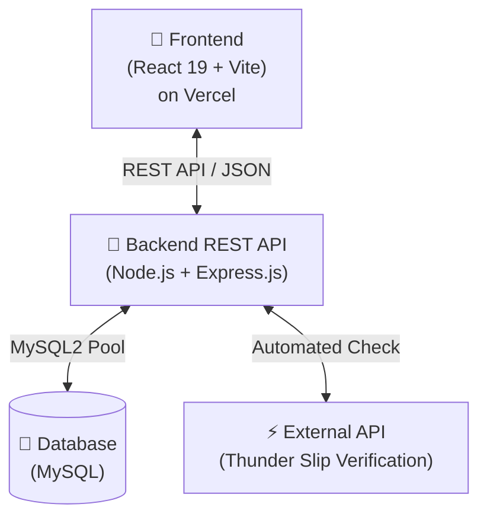

# 📌 สรุปสถาปัตยกรรมและเทคโนโลยีที่ใช้ (สำหรับเสนออาจารย์ที่ปรึกษา)
## ระบบจองและจัดการสนามกีฬา (Sport Complex Booking System)

### 💻 1. เทคโนโลยีหลัก (Tech Stack)
* **Frontend (`frontend/`):** React 19 + Vite + Tailwind CSS v4 + React Router DOM v7 (พัฒนาเป็น Single Page Application)
* **Backend (`backend/`):** Node.js + Express.js v5 + JWT (ยืนยันตัวตน) + Multer (รับอัปโหลดสลิป) + Winston (Logging)
* **Database (`schema_utf8.sql`):** MySQL / MariaDB (ตาราง `users`, `sports`, `courts`, `bookings`, `payments`)
* **External API Integration:** Thunder API (ใช้ตรวจสลิปโอนเงิน PromptPay แบบ Real-time)
* **Deployment:** Frontend บน Vercel (`sport-complex-plan.vercel.app`), Backend REST API รันบน Cloud Node.js Server

---

### 🏗️ 2. ภาพรวมสถาปัตยกรรมระบบ (System Architecture Diagram)

---

### 🗣️ 3. ประเด็นสำหรับใช้เน้นพูดคุยกับอาจารย์
1. **การเชื่อมต่อระหว่าง Frontend & Backend:** เป็นแบบ Decoupled Architecture ผ่าน RESTful API ช่วยให้ระบบโหลดเร็ว ไม่หน่วงเวลาเปลี่ยนหน้า
2. **การจัดการสภาวะการจอง (Concurrency & Time-Lock):** ใช้ระบบ ล็อกรอบสนาม 15 นาทีอัตโนมัติที่เซิร์ฟเวอร์ เพื่อแก้ปัญหาคนจองชนกันขณะโอนเงิน
3. **การตรวจสอบการชำระเงิน:** ต่อกับ Thunder API เพื่อสแกนสลิปโอนเงินอัตโนมัติ ลดภาระงานของแอดมินในการตรวจสลิป Manual
