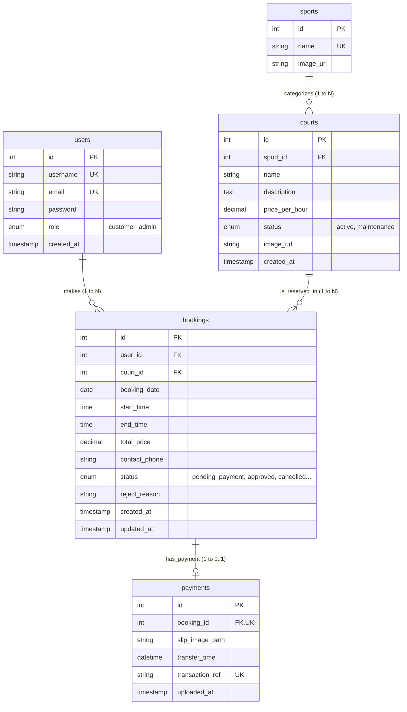

# 📌 ฐานข้อมูลและโครงสร้างตาราง (Database & ER Diagram)
## ระบบจองและจัดการสนามกีฬา (Sport Complex Booking System)

---

### 🗄️ 1. ตารางหลักในระบบ (Main Database Tables)

ฐานข้อมูลของระบบคือ `sport_complex_db` (รองรับภาษาไทยแบบ `utf8mb4_unicode_ci`) ประกอบด้วย **5 ตารางหลัก** (อ้างอิงจาก `schema_utf8.sql`):

#### 1. ตาราง `users` (เก็บข้อมูลสมาชิกและผู้ดูแลระบบ)
* `id` (INT, PK, Auto Increment) - รหัสผู้ใช้
* `username` (VARCHAR(50), UNIQUE) - ชื่อเข้าใช้ระบบ (5-30 ตัวอักษร)
* `email` (VARCHAR(100), UNIQUE) - อีเมลผู้ใช้
* `password` (VARCHAR(255)) - รหัสผ่านที่ผ่านการเข้ารหัสด้วย `bcryptjs`
* `role` (ENUM('customer', 'admin')) - สิทธิ์การใช้งาน (`customer` = ผู้ใช้ทั่วไป, `admin` = ผู้ดูแลระบบ)
* `created_at` (TIMESTAMP) - วันเวลาที่สมัครสมาชิก

#### 2. ตาราง `sports` (เก็บประเภทกีฬา)
* `id` (INT, PK, Auto Increment) - รหัสประเภทกีฬา
* `name` (VARCHAR(50), UNIQUE) - ชื่อประเภทกีฬา (เช่น ฟุตบอล, บาสเกตบอล, แบดมินตัน, วอลเลย์บอล)
* `image_url` (VARCHAR(255), NULL) - ลิงก์รูปไอคอน/ภาพประเภทกีฬา

#### 3. ตาราง `courts` (เก็บข้อมูลสนามกีฬา)
* `id` (INT, PK, Auto Increment) - รหัสสนาม
* `sport_id` (INT, FK -> `sports.id`) - อ้างอิงประเภทกีฬา
* `name` (VARCHAR(50)) - ชื่อสนาม (เช่น สนามฟุตบอล A (ในร่ม))
* `description` (TEXT, NULL) - รายละเอียดเพิ่มเติมของสนาม
* `price_per_hour` (DECIMAL(10, 2)) - ราคาเช่าสนามต่อชั่วโมง
* `status` (ENUM('active', 'maintenance')) - สถานะสนาม (`active` = เปิดให้บริการ, `maintenance` = ปิดปรับปรุงชั่วคราว)
* `image_url` (VARCHAR(255), NULL) - รูปภาพสนาม
* `created_at` (TIMESTAMP) - วันเวลาที่สร้างสนาม

#### 4. ตาราง `bookings` (เก็บรายการจองสนาม)
* `id` (INT, PK, Auto Increment) - รหัสใบจอง
* `user_id` (INT, FK -> `users.id`) - อ้างอิงผู้จอง
* `court_id` (INT, FK -> `courts.id`) - อ้างอิงสนามที่จอง
* `booking_date` (DATE) - วันที่เข้าใช้งานสนาม
* `start_time` (TIME) - เวลาเริ่มเข้าใช้ (เช่น 10:00:00)
* `end_time` (TIME) - เวลาสิ้นสุด (เช่น 12:00:00)
* `total_price` (DECIMAL(10, 2)) - ยอดเงินรวมทั้งหมด
* `contact_phone` (VARCHAR(20)) - เบอร์โทรศัพท์ติดต่อของผู้จอง
* `status` (ENUM) - สถานะใบจอง (`pending_payment`, `pending_approval`, `approved`, `rejected`, `cancelled`)
* `reject_reason` (VARCHAR(255), NULL) - เหตุผลการปฏิเสธ (ถ้ามี)
* `created_at` (TIMESTAMP) / `updated_at` (TIMESTAMP) - วันเวลาสร้างและอัปเดต

#### 5. ตาราง `payments` (เก็บข้อมูลการชำระเงินและสลิป)
* `id` (INT, PK, Auto Increment) - รหัสรายการชำระเงิน
* `booking_id` (INT, FK -> `bookings.id`, UNIQUE) - อ้างอิงใบจอง (1 ใบจองต่อ 1 รายการชำระเงิน)
* `slip_image_path` (VARCHAR(255)) - พาธไฟล์รูปสลิปโอนเงิน (หรือระบุ 'CASH_PAYMENT' กรณีเงินสด)
* `transfer_time` (DATETIME) - วันเวลาที่โอนเงินตามสลิป
* `transaction_ref` (VARCHAR(100), UNIQUE, NULL) - เลขที่อ้างอิงสลิปจากธนาคาร
* `uploaded_at` (TIMESTAMP) - วันเวลาที่อัปโหลดเข้าสู่ระบบ

---

### 🔗 2. ความสัมพันธ์ของข้อมูล (Entity Relationships)

1. **`sports` 1 ─── N `courts` (One-to-Many):**
   * ประเภทกีฬา 1 ประเภท มีได้หลายสนาม (เช่น ประเภทกีฬาแบดมินตัน มีคอร์ท 1, 2, 3, 4)
2. **`users` 1 ─── N `bookings` (One-to-Many):**
   * ผู้ใช้งาน 1 คน สามารถทำการจองสนามได้หลายครั้ง/หลายใบจอง
3. **`courts` 1 ─── N `bookings` (One-to-Many):**
   * สนาม 1 สนาม สามารถถูกจองในต่างช่วงเวลาได้หลายรายการจอง
4. **`bookings` 1 ─── 0..1 `payments` (One-to-One / Optional):**
   * ใบจอง 1 รายการ มีประวัติการชำระเงินได้สูงสุด 1 รายการ (กรณีรอชำระเงินจะยังไม่มี payment record)

---

### 📐 3. แผนภาพแสดงความสัมพันธ์ฐานข้อมูล (ER Diagram)

