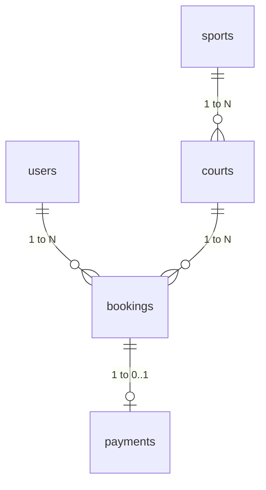

# 📌 สรุปฐานข้อมูลและ ER Diagram (สำหรับเสนออาจารย์ที่ปรึกษา)
## ระบบจองและจัดการสนามกีฬา (Sport Complex Booking System)

### 🗄️ 1. ตารางหลักในระบบ (5 Tables Summary)
1. **`users`:** เก็บข้อมูลบัญชีผู้ใช้ (Username, Email, Password-Hashed, Role: `customer`/`admin`)
2. **`sports`:** เก็บประเภทกีฬา (ฟุตบอล, บาสเกตบอล, แบดมินตัน, วอลเลย์บอล)
3. **`courts`:** เก็บข้อมูลสนาม (ชื่อสนาม, ราคา/ชม., สถานะ `active`/`maintenance`, FK อ้างอิง `sports.id`)
4. **`bookings`:** เก็บข้อมูลการจอง (วันที่, เวลาเริ่ม-จบ, ยอดรวม, เบอร์โทร, สถานะ `pending_payment`/`approved`/`cancelled`, FK อ้างอิง `users.id` และ `courts.id`)
5. **`payments`:** เก็บข้อมูลชำระเงิน (รูปสลิป, เวลาโอน, transaction_ref, FK อ้างอิง `bookings.id` แบบ 1-to-1)

---

### 🔗 2. ความสัมพันธ์สำคัญ (Relationships)
* **`sports` 1 ➔ N `courts`:** กีฬา 1 ประเภท มีได้หลายสนาม
* **`users` 1 ➔ N `bookings`:** ผู้ใช้ 1 คน จองสนามได้หลายครั้ง
* **`courts` 1 ➔ N `bookings`:** สนาม 1 สนาม ถูกจองได้หลายรอบเวลา
* **`bookings` 1 ➔ 0..1 `payments`:** รายการจอง 1 ใบ มีประวัติการชำระเงินได้สูงสุด 1 รายการ

---

### 📐 3. ER Diagram แบบสรุป

